# quetal

Single-cell RNA-seq analysis codes for the research Qu et al.
The `cellranger-scripts` folder holds scripts and configs for executing the cellranger multi pipeline.

---

## Workflow-250505: scRNA-seq Analysis Pipeline

Single-cell RNA-seq data processing pipeline for hPSC differentiation and chromatin remodeler knockdown experiments across 4 multiplexed pools (pools 1, 4, 6, 8).

## Pipeline Overview

```mermaid
flowchart TD

    %% ── Styles ──────────────────────────────────────────────
    classDef raw      fill:#9e9e9e,stroke:#616161,color:#fff
    classDef process  fill:#42a5f5,stroke:#1565c0,color:#fff
    classDef integ    fill:#66bb6a,stroke:#2e7d32,color:#fff
    classDef analysis fill:#ffa726,stroke:#e65100,color:#fff
    classDef fileNode fill:#e3f2fd,stroke:#1565c0,color:#000
    classDef output   fill:#ffccbc,stroke:#bf360c,color:#000

    %% ════════════════════════════════════════════════════════
    %% RAW DATA
    %% ════════════════════════════════════════════════════════
    subgraph RAW["Raw 10x CellRanger Data"]
        direction LR
        raw_p1[(Pool 1 — pool1_2<br/>10x h5)]:::raw
        raw_p6[(Pool 6 — pool6_3<br/>10x h5)]:::raw
        raw_p8[(Pool 8 — pool8<br/>10x h5)]:::raw
        raw_p4[(Pool 4 — pool4_2<br/>6 samples · 10x h5)]:::raw
    end

    %% ════════════════════════════════════════════════════════
    %% NOTEBOOK 1 — Preprocess & QC
    %% ════════════════════════════════════════════════════════
    subgraph NB1["1. Preprocess & QC (pools 1/6/8)"]
        nb1_load["Load 28 samples &<br/>annotate metadata"]:::process
        nb1_qc["QC filter<br/>(min_genes=300)"]:::process
        nb1_norm["Normalize & log1p"]:::process
        nb1_cc["Cell-cycle scoring &<br/>sample annotation"]:::process
        nb1_drop["Drop outlier<br/>(Ctrl-hPSC.p6)"]:::process
        nb1_scvi["Train scVI × 3 rounds<br/>remove MT-high &<br/>stress clusters"]:::process
        nb1_umap["UMAP + Leiden<br/>clustering"]:::process
    end

    raw_p1 --> nb1_load
    raw_p6 --> nb1_load
    raw_p8 --> nb1_load
    nb1_load --> nb1_qc --> nb1_norm --> nb1_cc --> nb1_drop --> nb1_scvi --> nb1_umap

    nb1_umap --> file_pp1([adata_merged.pp1.v250501.h5ad<br/>27 samples · ~124k cells]):::fileNode

    %% ════════════════════════════════════════════════════════
    %% NOTEBOOK 2 — Nuisance Regression
    %% ════════════════════════════════════════════════════════
    subgraph NB2["2. scVI Nuisance Regression"]
        nb2_nuis["Define nuisance gene sets<br/>(stress, MT, sex, cell cycle)"]:::process
        nb2_cov["Move nuisance expression<br/>to .obs covariates"]:::process
        nb2_hvg["Select top 1000 HVGs<br/>per batch"]:::process
        nb2_scvi["Retrain scVI with<br/>nuisance covariates<br/>(60 epochs)"]:::process
        nb2_mde["Compute MDE<br/>embedding"]:::process
    end

    file_pp1 --> nb2_nuis
    nb2_nuis --> nb2_cov --> nb2_hvg --> nb2_scvi --> nb2_mde

    nb2_mde --> file_250501([adata_merged.250501.h5ad]):::fileNode

    %% ════════════════════════════════════════════════════════
    %% NOTEBOOK 3 — Harmony + Reference Projection
    %% ════════════════════════════════════════════════════════
    subgraph NB3["3. Harmony Reference MDE Projection"]
        nb3_harm["Harmony on scVI latent<br/>(batch: pool + background)"]:::integ
        nb3_ref["Subset 12 reference<br/>(control) samples"]:::integ
        nb3_clust["Leiden clustering<br/>on reference"]:::integ
        nb3_mde["Build anchored MDE<br/>for reference"]:::integ
        nb3_proj["Project 15 KD query<br/>samples onto<br/>reference MDE"]:::integ
        nb3_cat["Concatenate all +<br/>diffusion map"]:::integ
        nb3_plots["Per-sample density &<br/>NANOG plots"]:::integ
    end

    file_250501 --> nb3_harm
    nb3_harm --> nb3_ref --> nb3_clust --> nb3_mde --> nb3_proj --> nb3_cat --> nb3_plots

    nb3_plots --> file_canon([adata_merged.250505-canonical.h5ad]):::fileNode

    %% ════════════════════════════════════════════════════════
    %% NOTEBOOK 4a — DEG Analysis
    %% ════════════════════════════════════════════════════════
    subgraph NB4a["4a. DEG Analysis (H1, pools 6 & 8)"]
        nb4a_sub["Subset H1 samples<br/>(pools 6 & 8)"]:::analysis
        nb4a_deg["rank_genes_groups<br/>per sample"]:::analysis
        nb4a_heat["Heatmap of top DEGs<br/>per condition"]:::analysis
    end

    file_canon --> nb4a_sub
    nb4a_sub --> nb4a_deg --> nb4a_heat

    nb4a_heat --> out_deg[/DEG-pool68H1-samples.csv<br/>+ heatmap PDF/]:::output

    %% ════════════════════════════════════════════════════════
    %% NOTEBOOK 4b — Exploratory Visualizations
    %% ════════════════════════════════════════════════════════
    subgraph NB4b["4b. Exploratory Visualizations (H1 & JARID2)"]
        nb4b_fig1["Fig 1: H1 diff. series<br/>MDE + NANOG feature plots"]:::analysis
        nb4b_fig2["Fig 2: Ctrl vs JARID2<br/>combined & split panels"]:::analysis
        nb4b_vio["NANOG violin plots"]:::analysis
        nb4b_prop["Cluster proportion<br/>analysis (JARID2-E4T,<br/>H1-E4T)"]:::analysis
    end

    file_canon --> nb4b_fig1
    file_canon --> nb4b_fig2
    nb4b_fig1 --> nb4b_vio
    nb4b_fig2 --> nb4b_vio
    nb4b_vio --> nb4b_prop

    nb4b_prop --> out_fig12[/Exploratory Figure PDFs/]:::output

    %% ════════════════════════════════════════════════════════
    %% NOTEBOOK 4c — Pool 4 SMARCB1 Integration
    %% ════════════════════════════════════════════════════════
    subgraph NB4c["4c. Pool 4 SMARCB1 Integration"]
        nb4c_load["Load pool 4<br/>QC / normalize"]:::integ
        nb4c_merge["Merge with reference<br/>(all 4 pools)"]:::integ
        nb4c_scvi["Retrain scVI<br/>(pools 1/4/6/8)"]:::integ
        nb4c_proj["Anchored MDE projection<br/>of SMARCB1 subset"]:::integ
        nb4c_clean["Remove outlier cluster"]:::integ
        nb4c_viz["MDE scatter +<br/>NANOG violin/feature plots"]:::analysis
    end

    raw_p4 --> nb4c_load
    file_250501 --> nb4c_merge
    file_canon --> nb4c_merge
    nb4c_load --> nb4c_merge --> nb4c_scvi --> nb4c_proj --> nb4c_clean --> nb4c_viz

    nb4c_viz --> file_p4([pool4_merged.250505.h5ad<br/>pool4_SMARCB1_merged.h5ad]):::fileNode
    nb4c_viz --> file_1468([adata_merged_pool1468.250505.h5ad]):::fileNode
    nb4c_viz --> out_p4[/Pool 4 SMARCB1<br/>Figure PDFs/]:::output

    %% ════════════════════════════════════════════════════════
    %% NOTEBOOK 5a — Population Distribution
    %% ════════════════════════════════════════════════════════
    subgraph NB5a["5a. Population Distribution MDE"]
        nb5a_split["Split Ctrl vs JARID2<br/>MDE panels"]:::analysis
        nb5a_arrows["Trajectory arrows &<br/>cluster labels"]:::analysis
    end

    file_canon --> nb5a_split
    nb5a_split --> nb5a_arrows

    nb5a_arrows --> out_5a[/figures/Figure2.Samples.<br/>MDEmap.pdf/]:::output

    %% ════════════════════════════════════════════════════════
    %% NOTEBOOK 5b — Violin Plots
    %% ════════════════════════════════════════════════════════
    subgraph NB5b["5b. Gene Violin Plots"]
        nb5b_fig1["Fig 1 violins<br/>(H1 series, 7 samples)"]:::analysis
        nb5b_fig2["Fig 2 violins<br/>(Ctrl vs JARID2,<br/>interleaved)"]:::analysis
        nb5b_genes["12 genes: NANOG, SOX21,<br/>OTX2, ZIC1, NES, SOX1,<br/>MAP2, COL2A1, TFAP2C,<br/>CDH11, FOSL1, NFATC4"]:::analysis
    end

    file_canon --> nb5b_fig1
    file_canon --> nb5b_fig2
    nb5b_fig1 --> nb5b_genes
    nb5b_fig2 --> nb5b_genes

    nb5b_genes --> out_5b[/"figures/Figure 1,2 .<br/>GENE.violin.pdf"/]:::output

    %% ════════════════════════════════════════════════════════
    %% NOTEBOOK 5c — MDE Feature Scatter Plots
    %% ════════════════════════════════════════════════════════
    subgraph NB5c["5c. Gene MDE Feature Plots"]
        nb5c_hull["Compute concave hull<br/>(all 27 samples)"]:::analysis
        nb5c_fig1["Fig 1 feature plots<br/>(per-sample, 7 panels)"]:::analysis
        nb5c_fig2["Fig 2 feature plots<br/>(per-sample, 8 panels)"]:::analysis
        nb5c_genes["12 genes × 2 figures"]:::analysis
    end

    file_canon --> nb5c_hull
    nb5c_hull --> nb5c_fig1
    nb5c_hull --> nb5c_fig2
    nb5c_fig1 --> nb5c_genes
    nb5c_fig2 --> nb5c_genes

    nb5c_genes --> out_5c[/"figures/Figure 1,2 .<br/>GENE.MDEmap.pdf"/]:::output
```

## Notebooks

| # | Notebook | Description |
|---|----------|-------------|
| 1 | `1.preprocess-qc-pools168.ipynb` | Load raw 10x data from pools 1/6/8 (28 samples), QC filtering (min_genes=300), normalization, cell-cycle scoring, drop outlier (Ctrl-hPSC.p6), iterative scVI training (3 rounds removing MT-high & stress clusters), UMAP + Leiden clustering |
| 2 | `2.scvi-nuisance-regression.ipynb` | Define nuisance gene sets (stress, MT, sex, cell cycle), move to .obs covariates, remove from var, select top 1000 HVGs per batch, retrain scVI (60 epochs), compute MDE embedding |
| 3 | `3.harmony-reference-mde-projection.ipynb` | Harmony batch correction on scVI latent (pool + background), build anchored MDE from 12 control samples, project 15 KD query samples via anchored embedding, compute diffusion map, per-sample density & NANOG plots |
| 4a | `4a.deg-h1-pool68.ipynb` | Subset H1 samples from pools 6 & 8, rank_genes_groups per sample, extract top DEGs per condition, heatmap |
| 4b | `4b.visualizations-h1-jarid2.ipynb` | Exploratory visualizations: Fig 1 (H1 diff. series, 7 samples) & Fig 2 (Ctrl vs JARID2, combined + split Ctrl/JARID2 panels), MDE scatter, NANOG feature maps, NANOG violins, cluster proportion analysis for JARID2-E4T and H1-E4T |
| 4c | `4c.pool4-smarcb1-integration.ipynb` | Load pool 4 (6 samples, 3 Ctrl + 3 SMARCB1-KD), QC/normalize, merge with reference, retrain scVI (all 4 pools, 60 epochs), project SMARCB1 subset onto canonical MDE via anchored embedding, remove outlier cluster, MDE scatter + NANOG violin/feature plots |
| 5a | `5a.population-distribution-mde.ipynb` | Split Ctrl vs JARID2-CRISPRi MDE panels with trajectory arrows, cluster labels, and MDE axis indicators. JARID2-E4T color: #78599d |
| 5b | `5b.gene-violin-plots.ipynb` | Violin plots (size=0, mean±SEM red diamonds) for 12 genes across Fig 1 (H1 series) and Fig 2 (Ctrl vs JARID2, interleaved). Genes: NANOG, SOX21, OTX2, ZIC1, NES, SOX1, MAP2, COL2A1, TFAP2C, CDH11, FOSL1, NFATC4 |
| 5c | `5c.gene-scatter-mde.ipynb` | Per-sample MDE feature plots with concave hull contours for 12 genes. Hull computed from all 27 canonical samples. Fixed colorbar range 0–1.5. Same 12 genes as 5b |

## Key Output Files

| File | Description |
|------|-------------|
| `adata_merged.pp1.v250501.h5ad` | After preprocessing & QC (27 samples, ~124k cells) |
| `adata_merged.250501.h5ad` | After nuisance regression & HVG selection |
| `adata_merged.250505-canonical.h5ad` | Canonical reference with Harmony + anchored MDE projections (27 samples, 123,822 cells, 17,960 genes) |
| `adata_merged_pool1468.250505.h5ad` | All 4 pools merged with retrained scVI |
| `pool4_merged.250505.h5ad` | Pool 4 integration intermediate (6 samples, ~31k cells) |
| `pool4_SMARCB1_merged.h5ad` | SMARCB1 subset projected onto canonical MDE (~17k cells after outlier removal) |
| `DEG-pool68H1-samples.csv` | Differentially expressed genes for H1 pools 6 & 8 |
| `figures/` | All publication-quality figure PDFs (MDE maps, violins, feature plots) |

## Flowchart Legend

| Shape | Meaning |
|-------|---------|
| Cylinder | Raw 10x input data |
| Rectangle | Processing step |
| Rounded rectangle | Intermediate h5ad file |
| Parallelogram | Final output (figures / CSVs) |

| Color | Meaning |
|-------|---------|
| Gray | Raw data |
| Blue | Processing / QC / scVI |
| Green | Integration / projection |
| Orange | Analysis / visualization |
| Light blue border | Intermediate h5ad file |
| Light red border | Final output |
