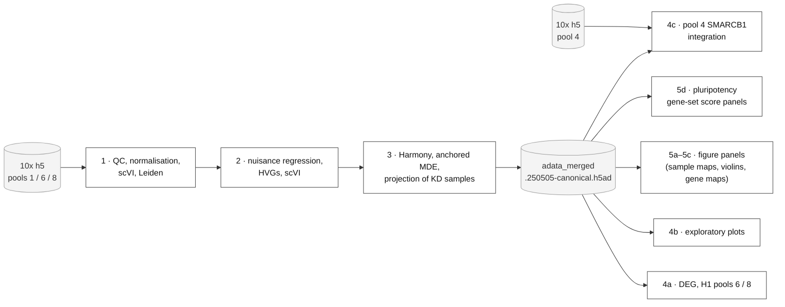

# quetal

Single-cell RNA-seq analysis for Qu et al.: hPSC differentiation and chromatin-remodeler knockdown
(JARID2, SMARCB1) across four multiplexed 10x pools (pools 1, 4, 6, 8).
`cellranger-scripts/` holds the `cellranger multi` configs.

## Pipeline

```mermaid
flowchart LR
    classDef data fill:#f4f4f4,stroke:#9e9e9e,color:#333
    classDef step fill:#ffffff,stroke:#424242,color:#111

    raw[(10x h5<br/>pools 1 / 6 / 8)]:::data
    raw4[(10x h5<br/>pool 4)]:::data

    nb1["1 · QC, normalisation,<br/>scVI, Leiden"]:::step
    nb2["2 · nuisance regression,<br/>HVGs, scVI"]:::step
    nb3["3 · Harmony, anchored MDE,<br/>projection of KD samples"]:::step
    canon[(adata_merged<br/>.250505-canonical.h5ad)]:::data

    nb4a["4a · DEG, H1 pools 6 / 8"]:::step
    nb4b["4b · exploratory plots"]:::step
    nb4c["4c · pool 4 SMARCB1<br/>integration"]:::step
    nb5["5a–5c · figure panels<br/>(sample maps, violins, gene maps)"]:::step
    nb5d["5d · pluripotency<br/>gene-set score panels"]:::step

    raw --> nb1 --> nb2 --> nb3 --> canon
    canon --> nb4a & nb4b & nb5 & nb5d
    raw4 --> nb4c
    canon --> nb4c
```

Intermediate files: `adata_merged.pp1.v250501.h5ad` (after 1), `adata_merged.250501.h5ad` (after 2).
Everything from step 4 onward reads only the canonical object.

## Notebooks and scripts

| # | File | What it does |
|---|------|--------------|
| 1 | `1.preprocess-qc-pools168.ipynb` | Load 28 samples from pools 1/6/8, QC (min_genes = 300), normalise + log1p, cell-cycle scoring, drop outlier sample Ctrl-hPSC.p6, three rounds of scVI removing MT-high and stress clusters, UMAP + Leiden |
| 2 | `2.scvi-nuisance-regression.ipynb` | Nuisance programmes (stress, MT, sex, cell cycle) moved to `.obs` covariates and removed from `.var`; top 1000 HVGs per batch; scVI retrained with covariates (60 epochs); MDE |
| 3 | `3.harmony-reference-mde-projection.ipynb` | Harmony on the scVI latent (pool + genetic background); anchored MDE built from the 12 control samples; 15 knockdown samples projected onto it; diffusion map; canonical object written |
| 4a | `4a.deg-h1-pool68.ipynb` | H1 samples of pools 6/8: `rank_genes_groups` per sample, top DEGs, heatmap → `DEG-pool68H1-samples.csv` |
| 4b | `4b.visualizations-h1-jarid2.ipynb` | Exploratory Fig 1 / Fig 2 panels (sample maps, NANOG feature maps and violins, cluster proportions); colour tables for the H1 series and Ctrl vs JARID2 |
| 4c | `4c.pool4-smarcb1-integration.ipynb` | Pool 4 (3 Ctrl + 3 SMARCB1-KD): QC, merge with reference, scVI over all four pools, anchored projection onto the canonical MDE, outlier removal, plots |
| 5a | `5a.population-distribution-mde.ipynb` | Fig 2 sample maps, Control vs JARID2-CRISPRi, with trajectory arrows and cluster labels → `figures/Figure2.Samples.MDEmap.pdf` |
| 5b | `5b.gene-violin-plots.ipynb` | Violins for 12 genes, Fig 1 (H1 series) and Fig 2 (Ctrl vs JARID2 interleaved) → `figures/Figure{1,2}.GENE.violin.pdf` |
| 5c | `5c.gene-scatter-mde.ipynb` | Per-sample MDE feature maps for the same 12 genes with a concave-hull outline of all 27 samples, colour range 0–1.5 → `figures/Figure{1,2}.GENE.MDEmap.pdf` |
| 5d | `5d.pluripotency-score/` | Pluripotency gene-set score (NANOG, FOXD3, GDF3, UTF1, TERT, PRDM14, DPPA3, DPPA5; `sc.tl.score_genes`, all 27 samples) replacing the single-gene NANOG panels. Three standalone scripts: Fig 1G right (per-sample score maps), Fig 2B score maps (Ctrl vs JARID2-CRISPRi) and Fig 2B violins with medians, Δ median and Mann–Whitney U. Legends and methods in `5d.pluripotency-score/PluriScore.legend_methods.md`; see its README for options |

12 genes used in 5b/5c: NANOG, SOX21, OTX2, ZIC1, NES, SOX1, MAP2, COL2A1, TFAP2C, CDH11, FOSL1, NFATC4.

## Data objects

| File | Content |
|------|---------|
| `adata_merged.pp1.v250501.h5ad` | After QC and preprocessing, 27 samples, ~124k cells |
| `adata_merged.250501.h5ad` | After nuisance regression and HVG selection |
| `adata_merged.250505-canonical.h5ad` | Canonical object: Harmony latent, anchored MDE (`obsm['X_mde']`), 123,822 cells × 17,960 genes, `layers['counts']` |
| `adata_merged_pool1468.250505.h5ad` | All four pools with retrained scVI |
| `pool4_merged.250505.h5ad`, `pool4_SMARCB1_merged.h5ad` | Pool 4 intermediate and SMARCB1 subset on the canonical MDE |
| `DEG-pool68H1-samples.csv` | DEGs, H1 pools 6/8 |
| `figures/` | Publication PDFs. Naming: `Figure{1,2}.<GENE>.{MDEmap,violin}.pdf` from 5b/5c, `Figure2.Samples.MDEmap.pdf` from 5a, `*.PluriScore.*` from 5d |

## Environment

Python 3.12 venv `dl2025` (`source ~/pp`), scanpy 1.12, scvi-tools 1.4, pymde, harmonypy, shapely.
Sample naming: `<line or KD>-<treatment>[.p<pool>]`, where `0.5E` = 12 h ectoderm, `E` = 24 h ectoderm,
`T` / `4T` = 1 or 4 days back in pluripotency medium.
