# Workflow-250505 Pipeline Flowchart

```mermaid
flowchart TD

    %% ── Styles ──────────────────────────────────────────────
    classDef raw      fill:#9e9e9e,stroke:#616161,color:#fff
    classDef process  fill:#42a5f5,stroke:#1565c0,color:#fff
    classDef integ    fill:#66bb6a,stroke:#2e7d32,color:#fff
    classDef analysis fill:#ffa726,stroke:#e65100,color:#fff
    classDef fileNode fill:#e3f2fd,stroke:#1565c0,color:#000
    classDef output   fill:#ffccbc,stroke:#bf360c,color:#000

    %% ════════════════════════════════════════════════════════
    %% RAW DATA
    %% ════════════════════════════════════════════════════════
    subgraph RAW["Raw 10x CellRanger Data"]
        direction LR
        raw_p1[(Pool 1 — pool1_2<br/>10x h5)]:::raw
        raw_p6[(Pool 6 — pool6_3<br/>10x h5)]:::raw
        raw_p8[(Pool 8 — pool8<br/>10x h5)]:::raw
        raw_p4[(Pool 4<br/>6 samples<br/>10x h5)]:::raw
    end

    %% ════════════════════════════════════════════════════════
    %% NOTEBOOK 1 — Preprocess & QC
    %% ════════════════════════════════════════════════════════
    subgraph NB1["1. Preprocess & QC (pools 1/6/8)"]
        nb1_load["Load per-sample &<br/>annotate metadata"]:::process
        nb1_qc["QC filter<br/>(min_genes=300)"]:::process
        nb1_norm["Normalize & log1p"]:::process
        nb1_cc["Cell-cycle scoring &<br/>sample annotation"]:::process
        nb1_drop["Drop outlier<br/>(Ctrl-hPSC.p6)"]:::process
        nb1_scvi["Train scVI (3 rounds)<br/>remove MT-high &<br/>stress clusters"]:::process
        nb1_umap["UMAP + Leiden<br/>clustering"]:::process
    end

    raw_p1 --> nb1_load
    raw_p6 --> nb1_load
    raw_p8 --> nb1_load
    nb1_load --> nb1_qc --> nb1_norm --> nb1_cc --> nb1_drop --> nb1_scvi --> nb1_umap

    nb1_umap --> file_pp1([adata_merged.pp1.v250501.h5ad<br/>27 samples · ~124k cells]):::fileNode

    %% ════════════════════════════════════════════════════════
    %% NOTEBOOK 2 — Nuisance Regression
    %% ════════════════════════════════════════════════════════
    subgraph NB2["2. scVI Nuisance Regression"]
        nb2_nuis["Define nuisance gene sets<br/>(stress, MT, sex, cell cycle)"]:::process
        nb2_cov["Move nuisance expression<br/>to .obs covariates"]:::process
        nb2_hvg["Select top 1000 HVGs<br/>per batch"]:::process
        nb2_scvi["Retrain scVI with<br/>nuisance covariates<br/>(60 epochs)"]:::process
        nb2_mde["Compute MDE<br/>embedding"]:::process
    end

    file_pp1 --> nb2_nuis
    nb2_nuis --> nb2_cov --> nb2_hvg --> nb2_scvi --> nb2_mde

    nb2_mde --> file_250501([adata_merged.250501.h5ad]):::fileNode

    %% ════════════════════════════════════════════════════════
    %% NOTEBOOK 3 — Harmony + Reference Projection
    %% ════════════════════════════════════════════════════════
    subgraph NB3["3. Harmony Reference MDE Projection"]
        nb3_harm["Harmony on scVI latent<br/>(batch: pool + background)"]:::integ
        nb3_ref["Subset 12 reference<br/>(control) samples"]:::integ
        nb3_clust["Leiden clustering<br/>on reference"]:::integ
        nb3_mde["Build anchored MDE<br/>for reference"]:::integ
        nb3_proj["Project 15 KD query<br/>samples onto<br/>reference MDE"]:::integ
        nb3_cat["Concatenate all +<br/>diffusion map"]:::integ
        nb3_plots["Per-sample density &<br/>NANOG plots"]:::integ
    end

    file_250501 --> nb3_harm
    nb3_harm --> nb3_ref --> nb3_clust --> nb3_mde --> nb3_proj --> nb3_cat --> nb3_plots

    nb3_plots --> file_canon([adata_merged.250505-canonical.h5ad]):::fileNode

    %% ════════════════════════════════════════════════════════
    %% NOTEBOOK 4a — DEG Analysis
    %% ════════════════════════════════════════════════════════
    subgraph NB4a["4a. DEG Analysis (H1, pools 6 & 8)"]
        nb4a_sub["Subset H1 samples<br/>(pools 6 & 8)"]:::analysis
        nb4a_deg["rank_genes_groups<br/>per sample"]:::analysis
        nb4a_heat["Heatmap"]:::analysis
    end

    file_canon --> nb4a_sub
    nb4a_sub --> nb4a_deg --> nb4a_heat

    nb4a_heat --> out_deg[/DEG-pool68H1-samples.csv<br/>+ heatmap PDF/]:::output

    %% ════════════════════════════════════════════════════════
    %% NOTEBOOK 4b — Visualizations (H1 & JARID2)
    %% ════════════════════════════════════════════════════════
    subgraph NB4b["4b. Visualizations (H1 & JARID2)"]
        nb4b_fig1["Subset Fig 1 samples<br/>(H1 diff. series, 7 samples)"]:::analysis
        nb4b_fig2["Subset Fig 2 samples<br/>(Ctrl vs JARID2, 8 samples)"]:::analysis
        nb4b_mde["MDE scatter plots<br/>& NANOG feature plots"]:::analysis
        nb4b_vio["NANOG violin plots"]:::analysis
        nb4b_prop["Cluster proportion<br/>analysis"]:::analysis
    end

    file_canon --> nb4b_fig1
    file_canon --> nb4b_fig2
    nb4b_fig1 --> nb4b_mde
    nb4b_fig2 --> nb4b_mde
    nb4b_mde --> nb4b_vio --> nb4b_prop

    nb4b_prop --> out_fig12[/Figure 1 & 2 PDFs<br/>MDE maps · violins/]:::output

    %% ════════════════════════════════════════════════════════
    %% NOTEBOOK 4c — Pool 4 SMARCB1 Integration
    %% ════════════════════════════════════════════════════════
    subgraph NB4c["4c. Pool 4 SMARCB1 Integration"]
        nb4c_load["Load pool 4<br/>QC / normalize"]:::integ
        nb4c_merge["Merge with reference<br/>(all 4 pools)"]:::integ
        nb4c_scvi["Retrain scVI<br/>(pools 1/4/6/8)"]:::integ
        nb4c_proj["Anchored MDE projection<br/>of SMARCB1 subset"]:::integ
        nb4c_clean["Remove outlier cluster"]:::integ
        nb4c_viz["MDE scatter +<br/>NANOG violin/feature plots"]:::analysis
    end

    raw_p4 --> nb4c_load
    file_250501 --> nb4c_merge
    file_canon --> nb4c_merge
    nb4c_load --> nb4c_merge --> nb4c_scvi --> nb4c_proj --> nb4c_clean --> nb4c_viz

    nb4c_viz --> file_p4([pool4_merged.250505.h5ad<br/>pool4_SMARCB1_merged.h5ad]):::fileNode
    nb4c_viz --> file_1468([adata_merged_pool1468.250505.h5ad]):::fileNode
    nb4c_viz --> out_p4[/Pool 4 SMARCB1<br/>Figure PDFs/]:::output

    %% ════════════════════════════════════════════════════════
    %% NOTEBOOK 7 — Color Fix + SOX21
    %% ════════════════════════════════════════════════════════
    subgraph NB7["7. Color Fix + SOX21 Plots"]
        nb7_color["Fix JARID2-E4T color<br/>(#65dcee → #78599d)"]:::analysis
        nb7_fig2["Regenerate Fig 2 MDE<br/>split Ctrl / JARID2 panels<br/>+ trajectory arrows"]:::analysis
        nb7_violin["Regenerate violins<br/>(size=0, mean±SEM)"]:::analysis
        nb7_sox["SOX21 MDE feature &<br/>violin plots"]:::analysis
    end

    file_canon --> nb7_color
    nb7_color --> nb7_fig2 --> nb7_violin --> nb7_sox

    nb7_sox --> out_color[/Updated Figure PDFs<br/>color fix + SOX21/]:::output
```

## Legend

| Shape | Meaning |
|-------|---------|
| Cylinder `[( )]` | Raw 10x input data |
| Rectangle `[ ]` | Processing step |
| Rounded rectangle `([ ])` | Intermediate h5ad file |
| Parallelogram `[/ /]` | Final output (figures / CSVs) |

| Color | Meaning |
|-------|---------|
| Gray | Raw data |
| Blue | Processing / QC / scVI |
| Green | Integration / projection |
| Orange | Analysis / visualization |
| Light blue border | Intermediate h5ad file |
| Light red border | Final output |
